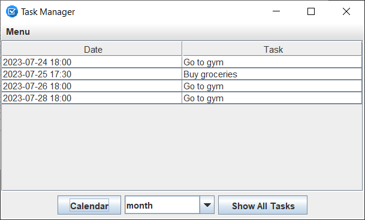
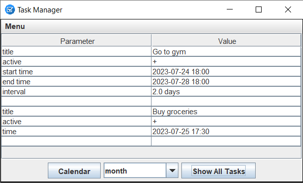
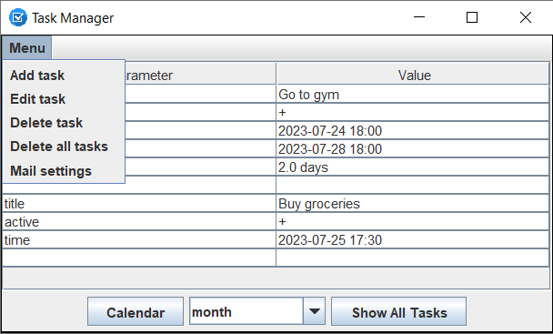
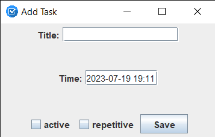
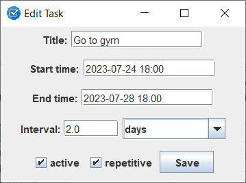

# NCTaskManager

NCTaskManager is a Java application designed for creating reminders. The application allows users to set up one-time or recurring reminders with specific intervals. Notifications can be sent via email or displayed as notifications on the computer.

## Features

- Create one-time reminders with a specific date and time.
- Set up recurring reminders with a defined interval.
- Receiving notifications via email and as computer notifications.
- Mark reminders as active/inactive.
- View a list of upcoming reminders.
- Edit or delete existing reminders.

## Technologies Used

- Java
- Swing

## Prerequisites

Before getting started with the NCTaskManager application, ensure that you have the following prerequisites:

- JDK 9
- Maven

## Installation

1. Clone this repository: `git clone https://github.com/marharita08/NCTaskManager`.
2. Run `install.cmd`.
3. Configure `src/main/resources/mail.properties.txt` with following properties:
   
 | Property                  | Description                                                                                        |
 |---------------------------|----------------------------------------------------------------------------------------------------|
 | username                  | The username for the email account used for sending notifications                                  |
 | password                  | The password for the email account used for sending notifications                                  |
 | mail.smtp.port            | The port number for the SMTP server                                                                |
 | mail.smtp.auth            | Specifies whether SMTP authentication is required for email notifications                          |
 | mail.smtp.starttls.enable | Specifies whether the STARTTLS command is used to enable encryption for secure email communication |
 | mail.smtp.host            | The host name or IP address of the SMTP server                                                     |

4. Run `run.cmd`.

## Screenshots

 
 

 

 
 

